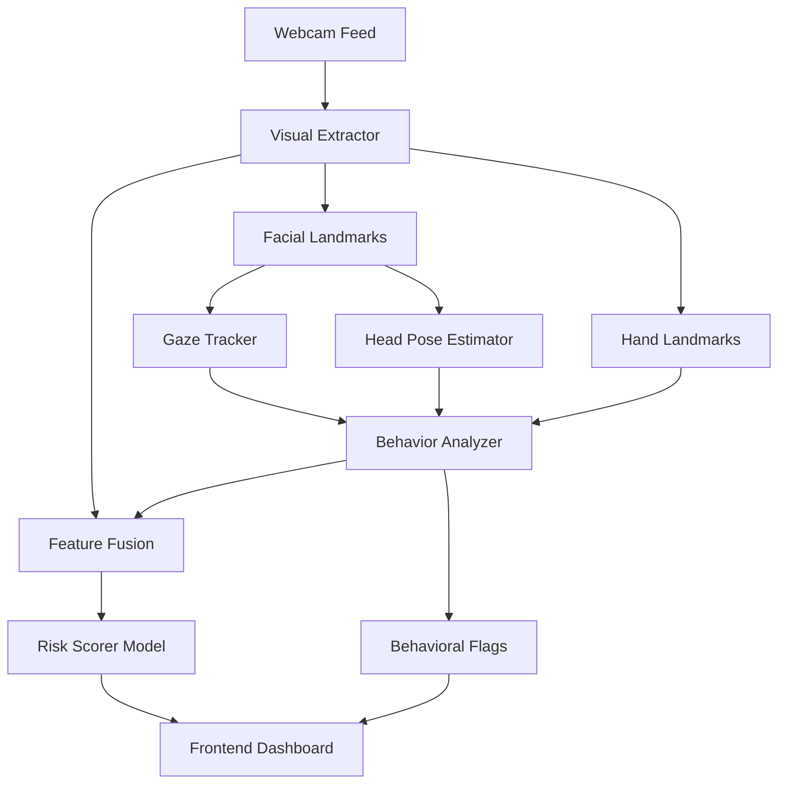

# 👁️ Behavioral & Visual Cheating Detection System

[](https://www.python.org/)
[](https://flask.palletsprojects.com/)
[](https://mediapipe.dev/)
[](https://www.tensorflow.org/)

A state-of-the-art, **Multimodal AI Proctoring System** designed to detect suspicious behaviors during online examinations using real-time computer vision and behavioral analysis.

---

## 🚀 Key Features

### 🔹 Real-Time Visual Extraction
Utilizes **MediaPipe Face Mesh** and **Hands** to track 468+ facial landmarks and hand gestures with high precision and low latency.
- **Iris Tracking:** Precise eye-center and iris-to-eye-corner ratio extraction for gaze estimation.
- **Head Pose Estimation:** 6-DOF head orientation (Pitch, Yaw, Roll) to detect looking away.
- **Hand Presence:** Detects hand-object interactions (e.g., using a phone or covering the face).

### 🔹 Advanced Behavioral Analysis
Goes beyond simple face detection by analyzing temporal patterns:
- **Gaze Velocity:** Detects rapid, suspicious eye movements.
- **Eye Aspect Ratio (EAR):** Monitors blinks and prolonged eye closure.
- **Suspicious Flags:** Automatically flags events such as "Looking Away," "No Face Detected," or "Multiple Faces Detected."

### 🔹 Intelligent Risk Scoring
Combines visual features into a unified **Cheating Risk Score** (0-100%).
- **Model Fusion:** Uses a primary **Random Forest** model for speed and an optimized **CNN-LSTM** model for sequence-based analysis.
- **Temporal Windowing:** Analyzes behavior over a sliding window (10-30 frames) to reduce false positives.

### 🔹 Modern Exam Interface
A sleek, responsive frontend built for an authentic exam experience, featuring:
- **Integrated Proctoring Dashboard:** Real-time feedback for the user/proctor.
- **Visual Warning System:** Dynamic alerts and risk-level indicators (Safe, Warning, Critical).

---

## 🏗️ System Architecture



---

## 🛠️ Installation & Setup

### 1. Clone the Repository
```bash
git clone https://github.com/sudikshabalajii/behavioral-visual-cheating-detection.git
cd behavioral-visual-cheating-detection
```

### 2. Install Dependencies
```bash
pip install -r requirements.txt
```

### 3. Prepare Models
Ensure you have the trained model artifacts in the `saved_models/` directory. If starting fresh, run the training pipeline:
```bash
python training/train.py
```

---

## 🏃 Usage

### Launching the Backend API
The Flask server handles both the real-time inference and serves the frontend interface.
```bash
python api/app.py
```
- **Frontend:** `http://localhost:5000/`
- **Health Check:** `http://localhost:5000/health`
- **Flag Logs:** `http://localhost:5000/flags`

---

## 📁 Project Structure

| Directory | Description |
| :--- | :--- |
| `api/` | Flask backend endpoints and server logic. |
| `webcam/` | Core CV logic: MediaPipe extraction, gaze tracking, and behavior analysis. |
| `frontend/` | Exam UI (HTML, CSS, JS) and proctoring dashboard. |
| `training/` | Scripts for training CNN-LSTM and Random Forest models. |
| `models/` | Feature engineering and data fusion utilities. |
| `scoring/` | Risk scoring algorithms and classification logic. |
| `saved_models/` | Serialized model artifacts (`.pkl`, `.keras`). |
| `data/` | Dataset and preprocessing scripts. |
| `plots/` | Generated training curves and evaluation matrices. |

---

## 📊 Model Performance

| Model | Accuracy | Precision | Recall | F1-Score |
| :--- | :--- | :--- | :--- | :--- |
| **Random Forest** | ~98.5% | 0.98 | 0.99 | 0.98 |
| **XGBoost** | ~98.2% | 0.98 | 0.98 | 0.98 |
| **CNN+LSTM** | ~96.8% | 0.95 | 0.97 | 0.96 |

> [!NOTE]
> Performance metrics may vary based on the dataset used. The system currently prioritizes **Random Forest** for real-time inference due to its low latency.

---

## 🛡️ License
Distributed under the MIT License. See `LICENSE` for more information.

## 👥 Contributors
- **Sudiksha Balaji** - *Initial Work*

---
<p align="center">
  Built with ❤️ for Academic Integrity
</p>
